# npm dependencies

## `github.com/npm/` only

```mermaid
graph LR;
  bin-links-->cmd-shim;
  bin-links-->npm-normalize-package-bin;
  bin-links-->read-cmd-shim;
  bin-links-->write-file-atomic;
  cacache-->fs-minipass;
  cacache-->infer-owner;
  cacache-->npmcli-fs["@npmcli/fs"];
  cacache-->npmcli-move-file["@npmcli/move-file"];
  cacache-->ssri;
  cacache-->unique-filename;
  dezalgo-->wrappy;
  init-package-json-->npm-package-arg;
  init-package-json-->promzard;
  init-package-json-->read-package-json;
  init-package-json-->read;
  init-package-json-->semver;
  init-package-json-->validate-npm-package-name;
  libnpmaccess-->npm-package-arg;
  libnpmaccess-->npm-registry-fetch;
  libnpmaccess-->npmcli-eslint-config["@npmcli/eslint-config"];
  libnpmaccess-->npmcli-template-oss["@npmcli/template-oss"];
  libnpmdiff-->npm-package-arg;
  libnpmdiff-->npmcli-arborist["@npmcli/arborist"];
  libnpmdiff-->npmcli-disparity-colors["@npmcli/disparity-colors"];
  libnpmdiff-->npmcli-eslint-config["@npmcli/eslint-config"];
  libnpmdiff-->npmcli-installed-package-contents["@npmcli/installed-package-contents"];
  libnpmdiff-->npmcli-template-oss["@npmcli/template-oss"];
  libnpmdiff-->pacote;
  libnpmexec-->bin-links;
  libnpmexec-->minify-registry-metadata;
  libnpmexec-->npm-package-arg;
  libnpmexec-->npmcli-arborist["@npmcli/arborist"];
  libnpmexec-->npmcli-ci-detect["@npmcli/ci-detect"];
  libnpmexec-->npmcli-eslint-config["@npmcli/eslint-config"];
  libnpmexec-->npmcli-fs["@npmcli/fs"];
  libnpmexec-->npmcli-run-script["@npmcli/run-script"];
  libnpmexec-->npmcli-template-oss["@npmcli/template-oss"];
  libnpmexec-->npmlog;
  libnpmexec-->pacote;
  libnpmexec-->proc-log;
  libnpmexec-->read-package-json-fast;
  libnpmexec-->read;
  libnpmexec-->semver;
  libnpmfund-->npmcli-arborist["@npmcli/arborist"];
  libnpmfund-->npmcli-eslint-config["@npmcli/eslint-config"];
  libnpmfund-->npmcli-template-oss["@npmcli/template-oss"];
  libnpmhook-->npm-registry-fetch;
  libnpmhook-->npmcli-eslint-config["@npmcli/eslint-config"];
  libnpmhook-->npmcli-template-oss["@npmcli/template-oss"];
  libnpmorg-->npm-registry-fetch;
  libnpmorg-->npmcli-eslint-config["@npmcli/eslint-config"];
  libnpmorg-->npmcli-template-oss["@npmcli/template-oss"];
  libnpmpack-->npm-package-arg;
  libnpmpack-->npmcli-arborist["@npmcli/arborist"];
  libnpmpack-->npmcli-eslint-config["@npmcli/eslint-config"];
  libnpmpack-->npmcli-run-script["@npmcli/run-script"];
  libnpmpack-->npmcli-template-oss["@npmcli/template-oss"];
  libnpmpack-->pacote;
  libnpmpublish-->libnpmpack;
  libnpmpublish-->normalize-package-data;
  libnpmpublish-->npm-package-arg;
  libnpmpublish-->npm-registry-fetch;
  libnpmpublish-->npmcli-eslint-config["@npmcli/eslint-config"];
  libnpmpublish-->npmcli-template-oss["@npmcli/template-oss"];
  libnpmpublish-->semver;
  libnpmpublish-->ssri;
  libnpmsearch-->npm-registry-fetch;
  libnpmsearch-->npmcli-eslint-config["@npmcli/eslint-config"];
  libnpmsearch-->npmcli-template-oss["@npmcli/template-oss"];
  libnpmteam-->npm-registry-fetch;
  libnpmteam-->npmcli-eslint-config["@npmcli/eslint-config"];
  libnpmteam-->npmcli-template-oss["@npmcli/template-oss"];
  libnpmversion-->json-parse-even-better-errors;
  libnpmversion-->npmcli-eslint-config["@npmcli/eslint-config"];
  libnpmversion-->npmcli-git["@npmcli/git"];
  libnpmversion-->npmcli-run-script["@npmcli/run-script"];
  libnpmversion-->npmcli-template-oss["@npmcli/template-oss"];
  libnpmversion-->proc-log;
  libnpmversion-->semver;
  make-fetch-happen-->cacache;
  make-fetch-happen-->minipass-fetch;
  make-fetch-happen-->ssri;
  nopt-->abbrev;
  normalize-package-data-->hosted-git-info;
  normalize-package-data-->semver;
  npm-->abbrev;
  npm-->cacache;
  npm-->fs-minipass;
  npm-->hosted-git-info;
  npm-->ini;
  npm-->init-package-json;
  npm-->json-parse-even-better-errors;
  npm-->libnpmaccess;
  npm-->libnpmdiff;
  npm-->libnpmexec;
  npm-->libnpmfund;
  npm-->libnpmhook;
  npm-->libnpmorg;
  npm-->libnpmpack;
  npm-->libnpmpublish;
  npm-->libnpmsearch;
  npm-->libnpmteam;
  npm-->libnpmversion;
  npm-->make-fetch-happen;
  npm-->nopt;
  npm-->npm-audit-report;
  npm-->npm-install-checks;
  npm-->npm-package-arg;
  npm-->npm-packlist;
  npm-->npm-pick-manifest;
  npm-->npm-profile;
  npm-->npm-registry-fetch;
  npm-->npm-user-validate;
  npm-->npmcli-arborist["@npmcli/arborist"];
  npm-->npmcli-ci-detect["@npmcli/ci-detect"];
  npm-->npmcli-config["@npmcli/config"];
  npm-->npmcli-eslint-config["@npmcli/eslint-config"];
  npm-->npmcli-fs["@npmcli/fs"];
  npm-->npmcli-git["@npmcli/git"];
  npm-->npmcli-map-workspaces["@npmcli/map-workspaces"];
  npm-->npmcli-package-json["@npmcli/package-json"];
  npm-->npmcli-promise-spawn["@npmcli/promise-spawn"];
  npm-->npmcli-run-script["@npmcli/run-script"];
  npm-->npmcli-template-oss["@npmcli/template-oss"];
  npm-->npmlog;
  npm-->pacote;
  npm-->parse-conflict-json;
  npm-->proc-log;
  npm-->read-package-json-fast;
  npm-->read-package-json;
  npm-->read;
  npm-->readdir-scoped-modules;
  npm-->semver;
  npm-->ssri;
  npm-->treeverse;
  npm-->validate-npm-package-name;
  npm-->write-file-atomic;
  npm-bundled-->npm-normalize-package-bin;
  npm-install-checks-->semver;
  npm-package-arg-->hosted-git-info;
  npm-package-arg-->proc-log;
  npm-package-arg-->semver;
  npm-package-arg-->validate-npm-package-name;
  npm-packlist-->ignore-walk;
  npm-pick-manifest-->npm-install-checks;
  npm-pick-manifest-->npm-normalize-package-bin;
  npm-pick-manifest-->npm-package-arg;
  npm-pick-manifest-->semver;
  npm-profile-->npm-registry-fetch;
  npm-profile-->proc-log;
  npm-registry-fetch-->make-fetch-happen;
  npm-registry-fetch-->minipass-fetch;
  npm-registry-fetch-->npm-package-arg;
  npm-registry-fetch-->proc-log;
  npmcli-arborist-->bin-links;
  npmcli-arborist-->cacache;
  npmcli-arborist-->json-parse-even-better-errors;
  npmcli-arborist-->minify-registry-metadata;
  npmcli-arborist-->nopt;
  npmcli-arborist-->npm-install-checks;
  npmcli-arborist-->npm-package-arg;
  npmcli-arborist-->npm-pick-manifest;
  npmcli-arborist-->npm-registry-fetch;
  npmcli-arborist-->npmcli-eslint-config["@npmcli/eslint-config"];
  npmcli-arborist-->npmcli-installed-package-contents["@npmcli/installed-package-contents"];
  npmcli-arborist-->npmcli-map-workspaces["@npmcli/map-workspaces"];
  npmcli-arborist-->npmcli-metavuln-calculator["@npmcli/metavuln-calculator"];
  npmcli-arborist-->npmcli-move-file["@npmcli/move-file"];
  npmcli-arborist-->npmcli-name-from-folder["@npmcli/name-from-folder"];
  npmcli-arborist-->npmcli-node-gyp["@npmcli/node-gyp"];
  npmcli-arborist-->npmcli-package-json["@npmcli/package-json"];
  npmcli-arborist-->npmcli-query["@npmcli/query"];
  npmcli-arborist-->npmcli-run-script["@npmcli/run-script"];
  npmcli-arborist-->npmcli-template-oss["@npmcli/template-oss"];
  npmcli-arborist-->npmlog;
  npmcli-arborist-->pacote;
  npmcli-arborist-->parse-conflict-json;
  npmcli-arborist-->proc-log;
  npmcli-arborist-->read-package-json-fast;
  npmcli-arborist-->readdir-scoped-modules;
  npmcli-arborist-->semver;
  npmcli-arborist-->ssri;
  npmcli-arborist-->treeverse;
  npmcli-config-->ini;
  npmcli-config-->nopt;
  npmcli-config-->npmcli-map-workspaces["@npmcli/map-workspaces"];
  npmcli-config-->proc-log;
  npmcli-config-->read-package-json-fast;
  npmcli-config-->semver;
  npmcli-fs-->semver;
  npmcli-git-->npm-pick-manifest;
  npmcli-git-->npmcli-promise-spawn["@npmcli/promise-spawn"];
  npmcli-git-->proc-log;
  npmcli-git-->semver;
  npmcli-installed-package-contents-->npm-bundled;
  npmcli-installed-package-contents-->npm-normalize-package-bin;
  npmcli-map-workspaces-->npmcli-name-from-folder["@npmcli/name-from-folder"];
  npmcli-map-workspaces-->read-package-json-fast;
  npmcli-metavuln-calculator-->cacache;
  npmcli-metavuln-calculator-->json-parse-even-better-errors;
  npmcli-metavuln-calculator-->pacote;
  npmcli-metavuln-calculator-->semver;
  npmcli-package-json-->json-parse-even-better-errors;
  npmcli-promise-spawn-->infer-owner;
  npmcli-query-->npm-package-arg;
  npmcli-query-->semver;
  npmcli-run-script-->npmcli-node-gyp["@npmcli/node-gyp"];
  npmcli-run-script-->npmcli-promise-spawn["@npmcli/promise-spawn"];
  npmcli-run-script-->read-package-json-fast;
  npmlog-->are-we-there-yet;
  npmlog-->gauge;
  pacote-->cacache;
  pacote-->fs-minipass;
  pacote-->infer-owner;
  pacote-->npm-package-arg;
  pacote-->npm-packlist;
  pacote-->npm-pick-manifest;
  pacote-->npm-registry-fetch;
  pacote-->npmcli-git["@npmcli/git"];
  pacote-->npmcli-installed-package-contents["@npmcli/installed-package-contents"];
  pacote-->npmcli-promise-spawn["@npmcli/promise-spawn"];
  pacote-->npmcli-run-script["@npmcli/run-script"];
  pacote-->proc-log;
  pacote-->read-package-json-fast;
  pacote-->read-package-json;
  pacote-->ssri;
  parse-conflict-json-->json-parse-even-better-errors;
  promzard-->read;
  read-->mute-stream;
  read-package-json-->json-parse-even-better-errors;
  read-package-json-->normalize-package-data;
  read-package-json-->npm-normalize-package-bin;
  read-package-json-fast-->json-parse-even-better-errors;
  read-package-json-fast-->npm-normalize-package-bin;
  readdir-scoped-modules-->dezalgo;
  unique-filename-->unique-slug;
```


## all dependencies
```mermaid
graph LR;
  acorn-globals-->acorn-walk;
  acorn-globals-->acorn;
  agent-base-->debug;
  agentkeepalive-->debug;
  agentkeepalive-->depd;
  agentkeepalive-->humanize-ms;
  aggregate-error-->clean-stack;
  aggregate-error-->indent-string;
  ansi-styles-->color-convert;
  are-we-there-yet-->delegates;
  are-we-there-yet-->readable-stream;
  babel-code-frame-->babel-highlight["@babel/highlight"];
  babel-core-->babel-code-frame["@babel/code-frame"];
  babel-core-->babel-generator["@babel/generator"];
  babel-core-->babel-helper-module-transforms["@babel/helper-module-transforms"];
  babel-core-->babel-helpers["@babel/helpers"];
  babel-core-->babel-parser["@babel/parser"];
  babel-core-->babel-template["@babel/template"];
  babel-core-->babel-traverse["@babel/traverse"];
  babel-core-->babel-types["@babel/types"];
  babel-core-->convert-source-map;
  babel-core-->debug;
  babel-core-->gensync;
  babel-core-->json5;
  babel-core-->lodash;
  babel-core-->resolve;
  babel-core-->semver;
  babel-core-->source-map;
  babel-generator-->babel-types["@babel/types"];
  babel-generator-->jsesc;
  babel-generator-->source-map;
  babel-helper-environment-visitor-->babel-types["@babel/types"];
  babel-helper-function-name-->babel-helper-get-function-arity["@babel/helper-get-function-arity"];
  babel-helper-function-name-->babel-template["@babel/template"];
  babel-helper-function-name-->babel-types["@babel/types"];
  babel-helper-get-function-arity-->babel-types["@babel/types"];
  babel-helper-hoist-variables-->babel-types["@babel/types"];
  babel-helper-module-imports-->babel-types["@babel/types"];
  babel-helper-module-transforms-->babel-helper-environment-visitor["@babel/helper-environment-visitor"];
  babel-helper-module-transforms-->babel-helper-module-imports["@babel/helper-module-imports"];
  babel-helper-module-transforms-->babel-helper-simple-access["@babel/helper-simple-access"];
  babel-helper-module-transforms-->babel-helper-split-export-declaration["@babel/helper-split-export-declaration"];
  babel-helper-module-transforms-->babel-helper-validator-identifier["@babel/helper-validator-identifier"];
  babel-helper-module-transforms-->babel-template["@babel/template"];
  babel-helper-module-transforms-->babel-traverse["@babel/traverse"];
  babel-helper-module-transforms-->babel-types["@babel/types"];
  babel-helper-simple-access-->babel-types["@babel/types"];
  babel-helper-split-export-declaration-->babel-types["@babel/types"];
  babel-helpers-->babel-template["@babel/template"];
  babel-helpers-->babel-traverse["@babel/traverse"];
  babel-helpers-->babel-types["@babel/types"];
  babel-highlight-->babel-helper-validator-identifier["@babel/helper-validator-identifier"];
  babel-highlight-->chalk;
  babel-highlight-->js-tokens;
  babel-plugin-apply-mdx-type-prop-->babel-core["@babel/core"];
  babel-plugin-apply-mdx-type-prop-->babel-helper-plugin-utils["@babel/helper-plugin-utils"];
  babel-plugin-apply-mdx-type-prop-->mdx-js-util["@mdx-js/util"];
  babel-plugin-extract-import-names-->babel-helper-plugin-utils["@babel/helper-plugin-utils"];
  babel-plugin-proposal-object-rest-spread-->babel-core["@babel/core"];
  babel-plugin-proposal-object-rest-spread-->babel-helper-plugin-utils["@babel/helper-plugin-utils"];
  babel-plugin-proposal-object-rest-spread-->babel-plugin-syntax-object-rest-spread["@babel/plugin-syntax-object-rest-spread"];
  babel-plugin-proposal-object-rest-spread-->babel-plugin-transform-parameters["@babel/plugin-transform-parameters"];
  babel-plugin-syntax-jsx-->babel-core["@babel/core"];
  babel-plugin-syntax-jsx-->babel-helper-plugin-utils["@babel/helper-plugin-utils"];
  babel-plugin-syntax-object-rest-spread-->babel-core["@babel/core"];
  babel-plugin-syntax-object-rest-spread-->babel-helper-plugin-utils["@babel/helper-plugin-utils"];
  babel-plugin-transform-parameters-->babel-core["@babel/core"];
  babel-plugin-transform-parameters-->babel-helper-plugin-utils["@babel/helper-plugin-utils"];
  babel-template-->babel-code-frame["@babel/code-frame"];
  babel-template-->babel-parser["@babel/parser"];
  babel-template-->babel-types["@babel/types"];
  babel-traverse-->babel-code-frame["@babel/code-frame"];
  babel-traverse-->babel-generator["@babel/generator"];
  babel-traverse-->babel-helper-environment-visitor["@babel/helper-environment-visitor"];
  babel-traverse-->babel-helper-function-name["@babel/helper-function-name"];
  babel-traverse-->babel-helper-hoist-variables["@babel/helper-hoist-variables"];
  babel-traverse-->babel-helper-split-export-declaration["@babel/helper-split-export-declaration"];
  babel-traverse-->babel-parser["@babel/parser"];
  babel-traverse-->babel-types["@babel/types"];
  babel-traverse-->debug;
  babel-traverse-->globals;
  babel-types-->babel-helper-validator-identifier["@babel/helper-validator-identifier"];
  babel-types-->to-fast-properties;
  bin-links-->cmd-shim;
  bin-links-->mkdirp-infer-owner;
  bin-links-->npm-normalize-package-bin;
  bin-links-->read-cmd-shim;
  bin-links-->rimraf;
  bin-links-->write-file-atomic;
  bindings-->file-uri-to-path;
  bl-->buffer;
  bl-->inherits;
  bl-->readable-stream;
  brace-expansion-->balanced-match;
  brace-expansion-->concat-map;
  buffer-->base64-js;
  buffer-->ieee754;
  builtins-->semver;
  cacache-->chownr;
  cacache-->fs-minipass;
  cacache-->glob;
  cacache-->infer-owner;
  cacache-->lru-cache;
  cacache-->minipass-collect;
  cacache-->minipass-flush;
  cacache-->minipass-pipeline;
  cacache-->minipass;
  cacache-->mkdirp;
  cacache-->npmcli-fs["@npmcli/fs"];
  cacache-->npmcli-move-file["@npmcli/move-file"];
  cacache-->p-map;
  cacache-->promise-inflight;
  cacache-->rimraf;
  cacache-->ssri;
  cacache-->tar;
  cacache-->unique-filename;
  chalk-->ansi-styles;
  chalk-->escape-string-regexp;
  chalk-->supports-color;
  cidr-regex-->ip-regex;
  cli-columns-->string-width;
  cli-columns-->strip-ansi;
  cli-table3-->colors-colors["@colors/colors"];
  cli-table3-->string-width;
  cmark-gfm-->bindings;
  cmark-gfm-->node-addon-api;
  cmark-gfm-->prebuild-install;
  cmd-shim-->mkdirp-infer-owner;
  color-convert-->color-name;
  columnify-->strip-ansi;
  columnify-->wcwidth;
  combined-stream-->delayed-stream;
  convert-source-map-->safe-buffer;
  cssstyle-->cssom;
  data-urls-->abab;
  data-urls-->whatwg-mimetype;
  data-urls-->whatwg-url;
  debug-->ms;
  decompress-response-->mimic-response;
  defaults-->clone;
  detab-->repeat-string;
  dezalgo-->asap;
  dezalgo-->wrappy;
  docs-->cmark-gfm;
  docs-->jsdom;
  docs-->marked-man;
  docs-->mdx-js-mdx["@mdx-js/mdx"];
  docs-->mkdirp;
  docs-->npmcli-eslint-config["@npmcli/eslint-config"];
  docs-->npmcli-fs["@npmcli/fs"];
  docs-->npmcli-promise-spawn["@npmcli/promise-spawn"];
  docs-->npmcli-template-oss["@npmcli/template-oss"];
  docs-->tap;
  docs-->which;
  docs-->yaml;
  domexception-->webidl-conversions;
  encoding-->iconv-lite;
  end-of-stream-->once;
  escodegen-->esprima;
  escodegen-->estraverse;
  escodegen-->esutils;
  escodegen-->optionator;
  escodegen-->source-map;
  form-data-->asynckit;
  form-data-->combined-stream;
  form-data-->mime-types;
  fs-minipass-->minipass;
  gauge-->aproba;
  gauge-->console-control-strings;
  gauge-->has-unicode;
  gauge-->object-assign;
  gauge-->signal-exit;
  gauge-->string-width;
  gauge-->strip-ansi;
  gauge-->wide-align;
  glob-->fs.realpath;
  glob-->inflight;
  glob-->inherits;
  glob-->minimatch;
  glob-->once;
  glob-->path-is-absolute;
  has-->function-bind;
  hast-to-hyperscript-->comma-separated-tokens;
  hast-to-hyperscript-->property-information;
  hast-to-hyperscript-->space-separated-tokens;
  hast-to-hyperscript-->style-to-object;
  hast-to-hyperscript-->types-unist["@types/unist"];
  hast-to-hyperscript-->unist-util-is;
  hast-to-hyperscript-->web-namespaces;
  hast-util-from-parse5-->hastscript;
  hast-util-from-parse5-->property-information;
  hast-util-from-parse5-->types-parse5["@types/parse5"];
  hast-util-from-parse5-->vfile-location;
  hast-util-from-parse5-->vfile;
  hast-util-from-parse5-->web-namespaces;
  hast-util-raw-->hast-util-from-parse5;
  hast-util-raw-->hast-util-to-parse5;
  hast-util-raw-->html-void-elements;
  hast-util-raw-->parse5;
  hast-util-raw-->types-hast["@types/hast"];
  hast-util-raw-->unist-util-position;
  hast-util-raw-->vfile;
  hast-util-raw-->web-namespaces;
  hast-util-raw-->xtend;
  hast-util-raw-->zwitch;
  hast-util-to-parse5-->hast-to-hyperscript;
  hast-util-to-parse5-->property-information;
  hast-util-to-parse5-->web-namespaces;
  hast-util-to-parse5-->xtend;
  hast-util-to-parse5-->zwitch;
  hastscript-->comma-separated-tokens;
  hastscript-->hast-util-parse-selector;
  hastscript-->property-information;
  hastscript-->space-separated-tokens;
  hastscript-->types-hast["@types/hast"];
  hosted-git-info-->lru-cache;
  html-encoding-sniffer-->whatwg-encoding;
  http-proxy-agent-->agent-base;
  http-proxy-agent-->debug;
  http-proxy-agent-->tootallnate-once["@tootallnate/once"];
  https-proxy-agent-->agent-base;
  https-proxy-agent-->debug;
  humanize-ms-->ms;
  iconv-lite-->safer-buffer;
  ignore-walk-->minimatch;
  inflight-->once;
  inflight-->wrappy;
  init-package-json-->npm-package-arg;
  init-package-json-->promzard;
  init-package-json-->read-package-json;
  init-package-json-->read;
  init-package-json-->semver;
  init-package-json-->validate-npm-package-license;
  init-package-json-->validate-npm-package-name;
  is-alphanumerical-->is-alphabetical;
  is-alphanumerical-->is-decimal;
  is-cidr-->cidr-regex;
  is-core-module-->has;
  is-fullwidth-code-point-->number-is-nan;
  jsdom-->abab;
  jsdom-->acorn-globals;
  jsdom-->acorn;
  jsdom-->canvas;
  jsdom-->cssom;
  jsdom-->cssstyle;
  jsdom-->data-urls;
  jsdom-->decimal.js;
  jsdom-->domexception;
  jsdom-->escodegen;
  jsdom-->form-data;
  jsdom-->html-encoding-sniffer;
  jsdom-->http-proxy-agent;
  jsdom-->https-proxy-agent;
  jsdom-->is-potential-custom-element-name;
  jsdom-->nwsapi;
  jsdom-->parse5;
  jsdom-->saxes;
  jsdom-->symbol-tree;
  jsdom-->tough-cookie;
  jsdom-->w3c-hr-time;
  jsdom-->w3c-xmlserializer;
  jsdom-->webidl-conversions;
  jsdom-->whatwg-encoding;
  jsdom-->whatwg-mimetype;
  jsdom-->whatwg-url;
  jsdom-->ws;
  jsdom-->xml-name-validator;
  levn-->prelude-ls;
  levn-->type-check;
  libnpmaccess-->nock;
  libnpmaccess-->npm-package-arg;
  libnpmaccess-->npm-registry-fetch;
  libnpmaccess-->npmcli-eslint-config["@npmcli/eslint-config"];
  libnpmaccess-->npmcli-template-oss["@npmcli/template-oss"];
  libnpmaccess-->tap;
  libnpmdiff-->binary-extensions;
  libnpmdiff-->diff;
  libnpmdiff-->minimatch;
  libnpmdiff-->npm-package-arg;
  libnpmdiff-->npmcli-arborist["@npmcli/arborist"];
  libnpmdiff-->npmcli-disparity-colors["@npmcli/disparity-colors"];
  libnpmdiff-->npmcli-eslint-config["@npmcli/eslint-config"];
  libnpmdiff-->npmcli-installed-package-contents["@npmcli/installed-package-contents"];
  libnpmdiff-->npmcli-template-oss["@npmcli/template-oss"];
  libnpmdiff-->pacote;
  libnpmdiff-->tap;
  libnpmdiff-->tar;
  libnpmexec-->bin-links;
  libnpmexec-->chalk;
  libnpmexec-->minify-registry-metadata;
  libnpmexec-->mkdirp-infer-owner;
  libnpmexec-->mkdirp;
  libnpmexec-->npm-package-arg;
  libnpmexec-->npmcli-arborist["@npmcli/arborist"];
  libnpmexec-->npmcli-ci-detect["@npmcli/ci-detect"];
  libnpmexec-->npmcli-eslint-config["@npmcli/eslint-config"];
  libnpmexec-->npmcli-fs["@npmcli/fs"];
  libnpmexec-->npmcli-run-script["@npmcli/run-script"];
  libnpmexec-->npmcli-template-oss["@npmcli/template-oss"];
  libnpmexec-->npmlog;
  libnpmexec-->pacote;
  libnpmexec-->proc-log;
  libnpmexec-->read-package-json-fast;
  libnpmexec-->read;
  libnpmexec-->semver;
  libnpmexec-->tap;
  libnpmexec-->walk-up-path;
  libnpmfund-->npmcli-arborist["@npmcli/arborist"];
  libnpmfund-->npmcli-eslint-config["@npmcli/eslint-config"];
  libnpmfund-->npmcli-template-oss["@npmcli/template-oss"];
  libnpmfund-->tap;
  libnpmhook-->aproba;
  libnpmhook-->nock;
  libnpmhook-->npm-registry-fetch;
  libnpmhook-->npmcli-eslint-config["@npmcli/eslint-config"];
  libnpmhook-->npmcli-template-oss["@npmcli/template-oss"];
  libnpmhook-->tap;
  libnpmorg-->aproba;
  libnpmorg-->minipass;
  libnpmorg-->nock;
  libnpmorg-->npm-registry-fetch;
  libnpmorg-->npmcli-eslint-config["@npmcli/eslint-config"];
  libnpmorg-->npmcli-template-oss["@npmcli/template-oss"];
  libnpmorg-->tap;
  libnpmpack-->nock;
  libnpmpack-->npm-package-arg;
  libnpmpack-->npmcli-arborist["@npmcli/arborist"];
  libnpmpack-->npmcli-eslint-config["@npmcli/eslint-config"];
  libnpmpack-->npmcli-run-script["@npmcli/run-script"];
  libnpmpack-->npmcli-template-oss["@npmcli/template-oss"];
  libnpmpack-->pacote;
  libnpmpack-->spawk;
  libnpmpack-->tap;
  libnpmpublish-->libnpmpack;
  libnpmpublish-->lodash.clonedeep;
  libnpmpublish-->nock;
  libnpmpublish-->normalize-package-data;
  libnpmpublish-->npm-package-arg;
  libnpmpublish-->npm-registry-fetch;
  libnpmpublish-->npmcli-eslint-config["@npmcli/eslint-config"];
  libnpmpublish-->npmcli-template-oss["@npmcli/template-oss"];
  libnpmpublish-->semver;
  libnpmpublish-->ssri;
  libnpmpublish-->tap;
  libnpmsearch-->nock;
  libnpmsearch-->npm-registry-fetch;
  libnpmsearch-->npmcli-eslint-config["@npmcli/eslint-config"];
  libnpmsearch-->npmcli-template-oss["@npmcli/template-oss"];
  libnpmsearch-->tap;
  libnpmteam-->aproba;
  libnpmteam-->nock;
  libnpmteam-->npm-registry-fetch;
  libnpmteam-->npmcli-eslint-config["@npmcli/eslint-config"];
  libnpmteam-->npmcli-template-oss["@npmcli/template-oss"];
  libnpmteam-->tap;
  libnpmversion-->json-parse-even-better-errors;
  libnpmversion-->npmcli-eslint-config["@npmcli/eslint-config"];
  libnpmversion-->npmcli-git["@npmcli/git"];
  libnpmversion-->npmcli-run-script["@npmcli/run-script"];
  libnpmversion-->npmcli-template-oss["@npmcli/template-oss"];
  libnpmversion-->proc-log;
  libnpmversion-->require-inject;
  libnpmversion-->semver;
  libnpmversion-->tap;
  lru-cache-->yallist;
  make-fetch-happen-->agentkeepalive;
  make-fetch-happen-->cacache;
  make-fetch-happen-->http-cache-semantics;
  make-fetch-happen-->http-proxy-agent;
  make-fetch-happen-->https-proxy-agent;
  make-fetch-happen-->is-lambda;
  make-fetch-happen-->lru-cache;
  make-fetch-happen-->minipass-collect;
  make-fetch-happen-->minipass-fetch;
  make-fetch-happen-->minipass-flush;
  make-fetch-happen-->minipass-pipeline;
  make-fetch-happen-->minipass;
  make-fetch-happen-->negotiator;
  make-fetch-happen-->promise-retry;
  make-fetch-happen-->socks-proxy-agent;
  make-fetch-happen-->ssri;
  marked-man-->marked;
  mdast-squeeze-paragraphs-->unist-util-remove;
  mdast-util-definitions-->unist-util-visit;
  mdast-util-to-hast-->mdast-util-definitions;
  mdast-util-to-hast-->mdurl;
  mdast-util-to-hast-->types-mdast["@types/mdast"];
  mdast-util-to-hast-->types-unist["@types/unist"];
  mdast-util-to-hast-->unist-builder;
  mdast-util-to-hast-->unist-util-generated;
  mdast-util-to-hast-->unist-util-position;
  mdast-util-to-hast-->unist-util-visit;
  mdx-js-mdx-->babel-core["@babel/core"];
  mdx-js-mdx-->babel-plugin-apply-mdx-type-prop;
  mdx-js-mdx-->babel-plugin-extract-import-names;
  mdx-js-mdx-->babel-plugin-syntax-jsx["@babel/plugin-syntax-jsx"];
  mdx-js-mdx-->babel-plugin-syntax-object-rest-spread["@babel/plugin-syntax-object-rest-spread"];
  mdx-js-mdx-->camelcase-css;
  mdx-js-mdx-->detab;
  mdx-js-mdx-->hast-util-raw;
  mdx-js-mdx-->lodash.uniq;
  mdx-js-mdx-->mdast-util-to-hast;
  mdx-js-mdx-->mdx-js-util["@mdx-js/util"];
  mdx-js-mdx-->remark-footnotes;
  mdx-js-mdx-->remark-mdx;
  mdx-js-mdx-->remark-parse;
  mdx-js-mdx-->remark-squeeze-paragraphs;
  mdx-js-mdx-->style-to-object;
  mdx-js-mdx-->unified;
  mdx-js-mdx-->unist-builder;
  mdx-js-mdx-->unist-util-visit;
  mime-types-->mime-db;
  minimatch-->brace-expansion;
  minipass-->yallist;
  minipass-collect-->minipass;
  minipass-fetch-->encoding;
  minipass-fetch-->minipass-sized;
  minipass-fetch-->minipass;
  minipass-fetch-->minizlib;
  minipass-flush-->minipass;
  minipass-json-stream-->jsonparse;
  minipass-json-stream-->minipass;
  minipass-pipeline-->minipass;
  minipass-sized-->minipass;
  minizlib-->minipass;
  minizlib-->yallist;
  mkdirp-infer-owner-->chownr;
  mkdirp-infer-owner-->infer-owner;
  mkdirp-infer-owner-->mkdirp;
  node-abi-->semver;
  node-gyp-->env-paths;
  node-gyp-->glob;
  node-gyp-->graceful-fs;
  node-gyp-->make-fetch-happen;
  node-gyp-->nopt;
  node-gyp-->npmlog;
  node-gyp-->rimraf;
  node-gyp-->semver;
  node-gyp-->tar;
  node-gyp-->which;
  nopt-->abbrev;
  normalize-package-data-->hosted-git-info;
  normalize-package-data-->is-core-module;
  normalize-package-data-->semver;
  normalize-package-data-->validate-npm-package-license;
  npm-->abbrev;
  npm-->archy;
  npm-->cacache;
  npm-->chalk;
  npm-->chownr;
  npm-->cli-columns;
  npm-->cli-table3;
  npm-->columnify;
  npm-->docs;
  npm-->fastest-levenshtein;
  npm-->fs-minipass;
  npm-->glob;
  npm-->graceful-fs;
  npm-->hosted-git-info;
  npm-->ini;
  npm-->init-package-json;
  npm-->is-cidr;
  npm-->isaacs-string-locale-compare["@isaacs/string-locale-compare"];
  npm-->json-parse-even-better-errors;
  npm-->libnpmaccess;
  npm-->libnpmdiff;
  npm-->libnpmexec;
  npm-->libnpmfund;
  npm-->libnpmhook;
  npm-->libnpmorg;
  npm-->libnpmpack;
  npm-->libnpmpublish;
  npm-->libnpmsearch;
  npm-->libnpmteam;
  npm-->libnpmversion;
  npm-->licensee;
  npm-->make-fetch-happen;
  npm-->minimatch;
  npm-->minipass-pipeline;
  npm-->minipass;
  npm-->mkdirp-infer-owner;
  npm-->mkdirp;
  npm-->ms;
  npm-->nock;
  npm-->node-gyp;
  npm-->nopt;
  npm-->npm-audit-report;
  npm-->npm-install-checks;
  npm-->npm-package-arg;
  npm-->npm-packlist;
  npm-->npm-pick-manifest;
  npm-->npm-profile;
  npm-->npm-registry-fetch;
  npm-->npm-user-validate;
  npm-->npmcli-arborist["@npmcli/arborist"];
  npm-->npmcli-ci-detect["@npmcli/ci-detect"];
  npm-->npmcli-config["@npmcli/config"];
  npm-->npmcli-eslint-config["@npmcli/eslint-config"];
  npm-->npmcli-fs["@npmcli/fs"];
  npm-->npmcli-git["@npmcli/git"];
  npm-->npmcli-map-workspaces["@npmcli/map-workspaces"];
  npm-->npmcli-package-json["@npmcli/package-json"];
  npm-->npmcli-promise-spawn["@npmcli/promise-spawn"];
  npm-->npmcli-run-script["@npmcli/run-script"];
  npm-->npmcli-template-oss["@npmcli/template-oss"];
  npm-->npmlog;
  npm-->opener;
  npm-->p-map;
  npm-->pacote;
  npm-->parse-conflict-json;
  npm-->proc-log;
  npm-->qrcode-terminal;
  npm-->read-package-json-fast;
  npm-->read-package-json;
  npm-->read;
  npm-->readdir-scoped-modules;
  npm-->rimraf;
  npm-->semver;
  npm-->smoke-tests;
  npm-->spawk;
  npm-->ssri;
  npm-->tap;
  npm-->tar;
  npm-->text-table;
  npm-->tiny-relative-date;
  npm-->treeverse;
  npm-->validate-npm-package-name;
  npm-->which;
  npm-->write-file-atomic;
  npm-audit-report-->chalk;
  npm-bundled-->npm-normalize-package-bin;
  npm-install-checks-->semver;
  npm-package-arg-->hosted-git-info;
  npm-package-arg-->proc-log;
  npm-package-arg-->semver;
  npm-package-arg-->validate-npm-package-name;
  npm-packlist-->ignore-walk;
  npm-pick-manifest-->npm-install-checks;
  npm-pick-manifest-->npm-normalize-package-bin;
  npm-pick-manifest-->npm-package-arg;
  npm-pick-manifest-->semver;
  npm-profile-->npm-registry-fetch;
  npm-profile-->proc-log;
  npm-registry-fetch-->make-fetch-happen;
  npm-registry-fetch-->minipass-fetch;
  npm-registry-fetch-->minipass-json-stream;
  npm-registry-fetch-->minipass;
  npm-registry-fetch-->minizlib;
  npm-registry-fetch-->npm-package-arg;
  npm-registry-fetch-->proc-log;
  npmcli-arborist-->benchmark;
  npmcli-arborist-->bin-links;
  npmcli-arborist-->cacache;
  npmcli-arborist-->chalk;
  npmcli-arborist-->common-ancestor-path;
  npmcli-arborist-->isaacs-string-locale-compare["@isaacs/string-locale-compare"];
  npmcli-arborist-->json-parse-even-better-errors;
  npmcli-arborist-->json-stringify-nice;
  npmcli-arborist-->minify-registry-metadata;
  npmcli-arborist-->minimatch;
  npmcli-arborist-->mkdirp-infer-owner;
  npmcli-arborist-->mkdirp;
  npmcli-arborist-->nock;
  npmcli-arborist-->nopt;
  npmcli-arborist-->npm-install-checks;
  npmcli-arborist-->npm-package-arg;
  npmcli-arborist-->npm-pick-manifest;
  npmcli-arborist-->npm-registry-fetch;
  npmcli-arborist-->npmcli-eslint-config["@npmcli/eslint-config"];
  npmcli-arborist-->npmcli-installed-package-contents["@npmcli/installed-package-contents"];
  npmcli-arborist-->npmcli-map-workspaces["@npmcli/map-workspaces"];
  npmcli-arborist-->npmcli-metavuln-calculator["@npmcli/metavuln-calculator"];
  npmcli-arborist-->npmcli-move-file["@npmcli/move-file"];
  npmcli-arborist-->npmcli-name-from-folder["@npmcli/name-from-folder"];
  npmcli-arborist-->npmcli-node-gyp["@npmcli/node-gyp"];
  npmcli-arborist-->npmcli-package-json["@npmcli/package-json"];
  npmcli-arborist-->npmcli-query["@npmcli/query"];
  npmcli-arborist-->npmcli-run-script["@npmcli/run-script"];
  npmcli-arborist-->npmcli-template-oss["@npmcli/template-oss"];
  npmcli-arborist-->npmlog;
  npmcli-arborist-->pacote;
  npmcli-arborist-->parse-conflict-json;
  npmcli-arborist-->proc-log;
  npmcli-arborist-->promise-all-reject-late;
  npmcli-arborist-->promise-call-limit;
  npmcli-arborist-->read-package-json-fast;
  npmcli-arborist-->readdir-scoped-modules;
  npmcli-arborist-->rimraf;
  npmcli-arborist-->semver;
  npmcli-arborist-->ssri;
  npmcli-arborist-->tap;
  npmcli-arborist-->tcompare;
  npmcli-arborist-->treeverse;
  npmcli-arborist-->walk-up-path;
  npmcli-config-->ini;
  npmcli-config-->mkdirp-infer-owner;
  npmcli-config-->nopt;
  npmcli-config-->npmcli-map-workspaces["@npmcli/map-workspaces"];
  npmcli-config-->proc-log;
  npmcli-config-->read-package-json-fast;
  npmcli-config-->semver;
  npmcli-config-->walk-up-path;
  npmcli-disparity-colors-->ansi-styles;
  npmcli-fs-->gar-promisify["@gar/promisify"];
  npmcli-fs-->semver;
  npmcli-git-->lru-cache;
  npmcli-git-->mkdirp;
  npmcli-git-->npm-pick-manifest;
  npmcli-git-->npmcli-promise-spawn["@npmcli/promise-spawn"];
  npmcli-git-->proc-log;
  npmcli-git-->promise-inflight;
  npmcli-git-->promise-retry;
  npmcli-git-->semver;
  npmcli-git-->which;
  npmcli-installed-package-contents-->npm-bundled;
  npmcli-installed-package-contents-->npm-normalize-package-bin;
  npmcli-map-workspaces-->glob;
  npmcli-map-workspaces-->minimatch;
  npmcli-map-workspaces-->npmcli-name-from-folder["@npmcli/name-from-folder"];
  npmcli-map-workspaces-->read-package-json-fast;
  npmcli-metavuln-calculator-->cacache;
  npmcli-metavuln-calculator-->json-parse-even-better-errors;
  npmcli-metavuln-calculator-->pacote;
  npmcli-metavuln-calculator-->semver;
  npmcli-move-file-->mkdirp;
  npmcli-move-file-->rimraf;
  npmcli-package-json-->json-parse-even-better-errors;
  npmcli-promise-spawn-->infer-owner;
  npmcli-query-->npm-package-arg;
  npmcli-query-->postcss-selector-parser;
  npmcli-query-->semver;
  npmcli-run-script-->node-gyp;
  npmcli-run-script-->npmcli-node-gyp["@npmcli/node-gyp"];
  npmcli-run-script-->npmcli-promise-spawn["@npmcli/promise-spawn"];
  npmcli-run-script-->read-package-json-fast;
  npmcli-run-script-->which;
  npmlog-->are-we-there-yet;
  npmlog-->console-control-strings;
  npmlog-->gauge;
  npmlog-->set-blocking;
  once-->wrappy;
  optionator-->deep-is;
  optionator-->fast-levenshtein;
  optionator-->levn;
  optionator-->prelude-ls;
  optionator-->type-check;
  optionator-->word-wrap;
  p-map-->aggregate-error;
  pacote-->cacache;
  pacote-->chownr;
  pacote-->fs-minipass;
  pacote-->infer-owner;
  pacote-->minipass;
  pacote-->mkdirp;
  pacote-->npm-package-arg;
  pacote-->npm-packlist;
  pacote-->npm-pick-manifest;
  pacote-->npm-registry-fetch;
  pacote-->npmcli-git["@npmcli/git"];
  pacote-->npmcli-installed-package-contents["@npmcli/installed-package-contents"];
  pacote-->npmcli-promise-spawn["@npmcli/promise-spawn"];
  pacote-->npmcli-run-script["@npmcli/run-script"];
  pacote-->proc-log;
  pacote-->promise-retry;
  pacote-->read-package-json-fast;
  pacote-->read-package-json;
  pacote-->rimraf;
  pacote-->ssri;
  pacote-->tar;
  parse-conflict-json-->json-parse-even-better-errors;
  parse-conflict-json-->just-diff-apply;
  parse-conflict-json-->just-diff;
  parse-entities-->character-entities-legacy;
  parse-entities-->character-entities;
  parse-entities-->character-reference-invalid;
  parse-entities-->is-alphanumerical;
  parse-entities-->is-decimal;
  parse-entities-->is-hexadecimal;
  postcss-selector-parser-->cssesc;
  postcss-selector-parser-->util-deprecate;
  prebuild-install-->detect-libc;
  prebuild-install-->expand-template;
  prebuild-install-->github-from-package;
  prebuild-install-->minimist;
  prebuild-install-->mkdirp-classic;
  prebuild-install-->napi-build-utils;
  prebuild-install-->node-abi;
  prebuild-install-->npmlog;
  prebuild-install-->pump;
  prebuild-install-->rc;
  prebuild-install-->simple-get;
  prebuild-install-->tar-fs;
  prebuild-install-->tunnel-agent;
  promise-retry-->err-code;
  promise-retry-->retry;
  promzard-->read;
  property-information-->xtend;
  pump-->end-of-stream;
  pump-->once;
  rc-->deep-extend;
  rc-->ini;
  rc-->minimist;
  rc-->strip-json-comments;
  read-->mute-stream;
  read-package-json-->glob;
  read-package-json-->json-parse-even-better-errors;
  read-package-json-->normalize-package-data;
  read-package-json-->npm-normalize-package-bin;
  read-package-json-fast-->json-parse-even-better-errors;
  read-package-json-fast-->npm-normalize-package-bin;
  readable-stream-->core-util-is;
  readable-stream-->inherits;
  readable-stream-->isarray;
  readable-stream-->process-nextick-args;
  readable-stream-->safe-buffer;
  readable-stream-->string_decoder;
  readable-stream-->util-deprecate;
  readdir-scoped-modules-->debuglog;
  readdir-scoped-modules-->dezalgo;
  readdir-scoped-modules-->graceful-fs;
  readdir-scoped-modules-->once;
  remark-mdx-->babel-core["@babel/core"];
  remark-mdx-->babel-helper-plugin-utils["@babel/helper-plugin-utils"];
  remark-mdx-->babel-plugin-proposal-object-rest-spread["@babel/plugin-proposal-object-rest-spread"];
  remark-mdx-->babel-plugin-syntax-jsx["@babel/plugin-syntax-jsx"];
  remark-mdx-->is-alphabetical;
  remark-mdx-->mdx-js-util["@mdx-js/util"];
  remark-mdx-->remark-parse;
  remark-mdx-->unified;
  remark-parse-->ccount;
  remark-parse-->collapse-white-space;
  remark-parse-->is-alphabetical;
  remark-parse-->is-decimal;
  remark-parse-->is-whitespace-character;
  remark-parse-->is-word-character;
  remark-parse-->markdown-escapes;
  remark-parse-->parse-entities;
  remark-parse-->repeat-string;
  remark-parse-->state-toggle;
  remark-parse-->trim-trailing-lines;
  remark-parse-->trim;
  remark-parse-->unherit;
  remark-parse-->unist-util-remove-position;
  remark-parse-->vfile-location;
  remark-parse-->xtend;
  remark-squeeze-paragraphs-->mdast-squeeze-paragraphs;
  resolve-->is-core-module;
  resolve-->path-parse;
  resolve-->supports-preserve-symlinks-flag;
  rimraf-->glob;
  saxes-->xmlchars;
  semver-->lru-cache;
  simple-get-->decompress-response;
  simple-get-->once;
  simple-get-->simple-concat;
  smoke-tests-->minify-registry-metadata;
  smoke-tests-->npmcli-eslint-config["@npmcli/eslint-config"];
  smoke-tests-->npmcli-promise-spawn["@npmcli/promise-spawn"];
  smoke-tests-->npmcli-template-oss["@npmcli/template-oss"];
  smoke-tests-->rimraf;
  smoke-tests-->tap;
  smoke-tests-->which;
  socks-->ip;
  socks-->smart-buffer;
  socks-proxy-agent-->agent-base;
  socks-proxy-agent-->debug;
  socks-proxy-agent-->socks;
  spdx-correct-->spdx-expression-parse;
  spdx-correct-->spdx-license-ids;
  spdx-expression-parse-->spdx-exceptions;
  spdx-expression-parse-->spdx-license-ids;
  ssri-->minipass;
  string-width-->code-point-at;
  string-width-->emoji-regex;
  string-width-->is-fullwidth-code-point;
  string-width-->strip-ansi;
  string_decoder-->safe-buffer;
  strip-ansi-->ansi-regex;
  style-to-object-->inline-style-parser;
  supports-color-->has-flag;
  tar-->chownr;
  tar-->fs-minipass;
  tar-->minipass;
  tar-->minizlib;
  tar-->mkdirp;
  tar-->yallist;
  tar-fs-->chownr;
  tar-fs-->mkdirp-classic;
  tar-fs-->pump;
  tar-fs-->tar-stream;
  tar-stream-->bl;
  tar-stream-->end-of-stream;
  tar-stream-->fs-constants;
  tar-stream-->inherits;
  tar-stream-->readable-stream;
  tough-cookie-->psl;
  tough-cookie-->punycode;
  tough-cookie-->universalify;
  tr46-->punycode;
  tunnel-agent-->safe-buffer;
  type-check-->prelude-ls;
  types-hast-->types-unist["@types/unist"];
  types-mdast-->types-unist["@types/unist"];
  unherit-->inherits;
  unherit-->xtend;
  unified-->bail;
  unified-->extend;
  unified-->is-buffer;
  unified-->is-plain-obj;
  unified-->trough;
  unified-->vfile;
  unique-filename-->unique-slug;
  unique-slug-->imurmurhash;
  unist-util-remove-->unist-util-is;
  unist-util-remove-position-->unist-util-visit;
  unist-util-stringify-position-->types-unist["@types/unist"];
  unist-util-visit-->types-unist["@types/unist"];
  unist-util-visit-->unist-util-is;
  unist-util-visit-->unist-util-visit-parents;
  unist-util-visit-parents-->types-unist["@types/unist"];
  unist-util-visit-parents-->unist-util-is;
  validate-npm-package-license-->spdx-correct;
  validate-npm-package-license-->spdx-expression-parse;
  validate-npm-package-name-->builtins;
  vfile-->is-buffer;
  vfile-->types-unist["@types/unist"];
  vfile-->unist-util-stringify-position;
  vfile-->vfile-message;
  vfile-message-->types-unist["@types/unist"];
  vfile-message-->unist-util-stringify-position;
  w3c-hr-time-->browser-process-hrtime;
  w3c-xmlserializer-->xml-name-validator;
  wcwidth-->defaults;
  whatwg-encoding-->iconv-lite;
  whatwg-url-->tr46;
  whatwg-url-->webidl-conversions;
  which-->isexe;
  wide-align-->string-width;
  write-file-atomic-->imurmurhash;
  write-file-atomic-->signal-exit;
  ws-->bufferutil;
  ws-->utf-8-validate;
```

## npm dependency heirarchy

These are the groups of dependencies in npm that depend on each other.
Each group depends on packages lower down the chain, nothing depends on
packages higher up the chain.

 - npm
 - libnpmpublish
 - libnpmdiff, libnpmexec, libnpmfund, libnpmpack
 - @npmcli/arborist
 - @npmcli/metavuln-calculator
 - pacote, libnpmaccess, libnpmhook, libnpmorg, libnpmsearch, libnpmteam, npm-profile
 - npm-registry-fetch, libnpmversion
 - @npmcli/git, make-fetch-happen, @npmcli/config, init-package-json
 - @npmcli/installed-package-contents, @npmcli/map-workspaces, cacache, npm-pick-manifest, @npmcli/run-script, read-package-json, @npmcli/query, readdir-scoped-modules, promzard
 - npm-bundled, read-package-json-fast, @npmcli/fs, unique-filename, @npmcli/promise-spawn, npm-install-checks, npm-package-arg, npm-packlist, normalize-package-data, @npmcli/package-json, bin-links, nopt, npmlog, parse-conflict-json, dezalgo, read
 - npm-normalize-package-bin, @npmcli/name-from-folder, json-parse-even-better-errors, semver, @npmcli/move-file, fs-minipass, infer-owner, ssri, unique-slug, hosted-git-info, proc-log, validate-npm-package-name, @npmcli/node-gyp, ignore-walk, minipass-fetch, cmd-shim, read-cmd-shim, write-file-atomic, abbrev, are-we-there-yet, gauge, wrappy, treeverse, @npmcli/eslint-config, @npmcli/template-oss, minify-registry-metadata, @npmcli/disparity-colors, @npmcli/ci-detect, mute-stream, ini, npm-audit-report, npm-user-validate