# npm dependencies

## `github.com/npm/` only

```mermaid
graph LR;
  bin-links-->cmd-shim;
  bin-links-->npm-normalize-package-bin;
  bin-links-->read-cmd-shim;
  bin-links-->write-file-atomic;
  cacache-->fs-minipass;
  cacache-->npmcli-fs["@npmcli/fs"];
  cacache-->ssri;
  cacache-->unique-filename;
  init-package-json-->npm-package-arg;
  init-package-json-->promzard;
  init-package-json-->read-package-json;
  init-package-json-->read;
  init-package-json-->semver;
  init-package-json-->validate-npm-package-name;
  libnpmaccess-->npm-package-arg;
  libnpmaccess-->npm-registry-fetch;
  libnpmaccess-->npmcli-eslint-config["@npmcli/eslint-config"];
  libnpmaccess-->npmcli-mock-registry["@npmcli/mock-registry"];
  libnpmaccess-->npmcli-template-oss["@npmcli/template-oss"];
  libnpmdiff-->npm-package-arg;
  libnpmdiff-->npmcli-arborist["@npmcli/arborist"];
  libnpmdiff-->npmcli-disparity-colors["@npmcli/disparity-colors"];
  libnpmdiff-->npmcli-eslint-config["@npmcli/eslint-config"];
  libnpmdiff-->npmcli-installed-package-contents["@npmcli/installed-package-contents"];
  libnpmdiff-->npmcli-template-oss["@npmcli/template-oss"];
  libnpmdiff-->pacote;
  libnpmexec-->bin-links;
  libnpmexec-->npm-package-arg;
  libnpmexec-->npmcli-arborist["@npmcli/arborist"];
  libnpmexec-->npmcli-eslint-config["@npmcli/eslint-config"];
  libnpmexec-->npmcli-mock-registry["@npmcli/mock-registry"];
  libnpmexec-->npmcli-run-script["@npmcli/run-script"];
  libnpmexec-->npmcli-template-oss["@npmcli/template-oss"];
  libnpmexec-->npmlog;
  libnpmexec-->pacote;
  libnpmexec-->proc-log;
  libnpmexec-->read-package-json-fast;
  libnpmexec-->read;
  libnpmexec-->semver;
  libnpmfund-->npmcli-arborist["@npmcli/arborist"];
  libnpmfund-->npmcli-eslint-config["@npmcli/eslint-config"];
  libnpmfund-->npmcli-template-oss["@npmcli/template-oss"];
  libnpmhook-->npm-registry-fetch;
  libnpmhook-->npmcli-eslint-config["@npmcli/eslint-config"];
  libnpmhook-->npmcli-template-oss["@npmcli/template-oss"];
  libnpmorg-->npm-registry-fetch;
  libnpmorg-->npmcli-eslint-config["@npmcli/eslint-config"];
  libnpmorg-->npmcli-template-oss["@npmcli/template-oss"];
  libnpmpack-->npm-package-arg;
  libnpmpack-->npmcli-arborist["@npmcli/arborist"];
  libnpmpack-->npmcli-eslint-config["@npmcli/eslint-config"];
  libnpmpack-->npmcli-run-script["@npmcli/run-script"];
  libnpmpack-->npmcli-template-oss["@npmcli/template-oss"];
  libnpmpack-->pacote;
  libnpmpublish-->normalize-package-data;
  libnpmpublish-->npm-package-arg;
  libnpmpublish-->npm-registry-fetch;
  libnpmpublish-->npmcli-eslint-config["@npmcli/eslint-config"];
  libnpmpublish-->npmcli-mock-globals["@npmcli/mock-globals"];
  libnpmpublish-->npmcli-mock-registry["@npmcli/mock-registry"];
  libnpmpublish-->npmcli-template-oss["@npmcli/template-oss"];
  libnpmpublish-->proc-log;
  libnpmpublish-->semver;
  libnpmpublish-->ssri;
  libnpmsearch-->npm-registry-fetch;
  libnpmsearch-->npmcli-eslint-config["@npmcli/eslint-config"];
  libnpmsearch-->npmcli-template-oss["@npmcli/template-oss"];
  libnpmteam-->npm-registry-fetch;
  libnpmteam-->npmcli-eslint-config["@npmcli/eslint-config"];
  libnpmteam-->npmcli-template-oss["@npmcli/template-oss"];
  libnpmversion-->json-parse-even-better-errors;
  libnpmversion-->npmcli-eslint-config["@npmcli/eslint-config"];
  libnpmversion-->npmcli-git["@npmcli/git"];
  libnpmversion-->npmcli-run-script["@npmcli/run-script"];
  libnpmversion-->npmcli-template-oss["@npmcli/template-oss"];
  libnpmversion-->proc-log;
  libnpmversion-->semver;
  make-fetch-happen-->cacache;
  make-fetch-happen-->minipass-fetch;
  make-fetch-happen-->ssri;
  nopt-->abbrev;
  normalize-package-data-->hosted-git-info;
  normalize-package-data-->semver;
  npm-->abbrev;
  npm-->cacache;
  npm-->fs-minipass;
  npm-->hosted-git-info;
  npm-->ini;
  npm-->init-package-json;
  npm-->json-parse-even-better-errors;
  npm-->libnpmaccess;
  npm-->libnpmdiff;
  npm-->libnpmexec;
  npm-->libnpmfund;
  npm-->libnpmhook;
  npm-->libnpmorg;
  npm-->libnpmpack;
  npm-->libnpmpublish;
  npm-->libnpmsearch;
  npm-->libnpmteam;
  npm-->libnpmversion;
  npm-->make-fetch-happen;
  npm-->nopt;
  npm-->npm-audit-report;
  npm-->npm-install-checks;
  npm-->npm-package-arg;
  npm-->npm-packlist;
  npm-->npm-pick-manifest;
  npm-->npm-profile;
  npm-->npm-registry-fetch;
  npm-->npm-user-validate;
  npm-->npmcli-arborist["@npmcli/arborist"];
  npm-->npmcli-config["@npmcli/config"];
  npm-->npmcli-docs["@npmcli/docs"];
  npm-->npmcli-eslint-config["@npmcli/eslint-config"];
  npm-->npmcli-fs["@npmcli/fs"];
  npm-->npmcli-git["@npmcli/git"];
  npm-->npmcli-map-workspaces["@npmcli/map-workspaces"];
  npm-->npmcli-mock-globals["@npmcli/mock-globals"];
  npm-->npmcli-mock-registry["@npmcli/mock-registry"];
  npm-->npmcli-package-json["@npmcli/package-json"];
  npm-->npmcli-promise-spawn["@npmcli/promise-spawn"];
  npm-->npmcli-run-script["@npmcli/run-script"];
  npm-->npmcli-smoke-tests["@npmcli/smoke-tests"];
  npm-->npmcli-template-oss["@npmcli/template-oss"];
  npm-->npmlog;
  npm-->pacote;
  npm-->parse-conflict-json;
  npm-->proc-log;
  npm-->read;
  npm-->semver;
  npm-->ssri;
  npm-->validate-npm-package-name;
  npm-->write-file-atomic;
  npm-bundled-->npm-normalize-package-bin;
  npm-install-checks-->semver;
  npm-package-arg-->hosted-git-info;
  npm-package-arg-->proc-log;
  npm-package-arg-->semver;
  npm-package-arg-->validate-npm-package-name;
  npm-packlist-->ignore-walk;
  npm-pick-manifest-->npm-install-checks;
  npm-pick-manifest-->npm-normalize-package-bin;
  npm-pick-manifest-->npm-package-arg;
  npm-pick-manifest-->semver;
  npm-profile-->npm-registry-fetch;
  npm-profile-->proc-log;
  npm-registry-fetch-->make-fetch-happen;
  npm-registry-fetch-->minipass-fetch;
  npm-registry-fetch-->npm-package-arg;
  npm-registry-fetch-->proc-log;
  npmcli-arborist-->bin-links;
  npmcli-arborist-->cacache;
  npmcli-arborist-->hosted-git-info;
  npmcli-arborist-->json-parse-even-better-errors;
  npmcli-arborist-->minify-registry-metadata;
  npmcli-arborist-->nopt;
  npmcli-arborist-->npm-install-checks;
  npmcli-arborist-->npm-package-arg;
  npmcli-arborist-->npm-pick-manifest;
  npmcli-arborist-->npm-registry-fetch;
  npmcli-arborist-->npmcli-eslint-config["@npmcli/eslint-config"];
  npmcli-arborist-->npmcli-fs["@npmcli/fs"];
  npmcli-arborist-->npmcli-installed-package-contents["@npmcli/installed-package-contents"];
  npmcli-arborist-->npmcli-map-workspaces["@npmcli/map-workspaces"];
  npmcli-arborist-->npmcli-metavuln-calculator["@npmcli/metavuln-calculator"];
  npmcli-arborist-->npmcli-name-from-folder["@npmcli/name-from-folder"];
  npmcli-arborist-->npmcli-node-gyp["@npmcli/node-gyp"];
  npmcli-arborist-->npmcli-package-json["@npmcli/package-json"];
  npmcli-arborist-->npmcli-query["@npmcli/query"];
  npmcli-arborist-->npmcli-run-script["@npmcli/run-script"];
  npmcli-arborist-->npmcli-template-oss["@npmcli/template-oss"];
  npmcli-arborist-->npmlog;
  npmcli-arborist-->pacote;
  npmcli-arborist-->parse-conflict-json;
  npmcli-arborist-->proc-log;
  npmcli-arborist-->read-package-json-fast;
  npmcli-arborist-->semver;
  npmcli-arborist-->ssri;
  npmcli-config-->ini;
  npmcli-config-->nopt;
  npmcli-config-->npmcli-eslint-config["@npmcli/eslint-config"];
  npmcli-config-->npmcli-map-workspaces["@npmcli/map-workspaces"];
  npmcli-config-->npmcli-mock-globals["@npmcli/mock-globals"];
  npmcli-config-->npmcli-template-oss["@npmcli/template-oss"];
  npmcli-config-->proc-log;
  npmcli-config-->read-package-json-fast;
  npmcli-config-->semver;
  npmcli-docs-->ignore-walk;
  npmcli-docs-->npmcli-config["@npmcli/config"];
  npmcli-docs-->npmcli-eslint-config["@npmcli/eslint-config"];
  npmcli-docs-->npmcli-template-oss["@npmcli/template-oss"];
  npmcli-docs-->semver;
  npmcli-fs-->semver;
  npmcli-git-->npm-pick-manifest;
  npmcli-git-->npmcli-promise-spawn["@npmcli/promise-spawn"];
  npmcli-git-->proc-log;
  npmcli-git-->semver;
  npmcli-installed-package-contents-->npm-bundled;
  npmcli-installed-package-contents-->npm-normalize-package-bin;
  npmcli-map-workspaces-->npmcli-name-from-folder["@npmcli/name-from-folder"];
  npmcli-map-workspaces-->read-package-json-fast;
  npmcli-metavuln-calculator-->cacache;
  npmcli-metavuln-calculator-->json-parse-even-better-errors;
  npmcli-metavuln-calculator-->pacote;
  npmcli-metavuln-calculator-->semver;
  npmcli-mock-globals-->npmcli-eslint-config["@npmcli/eslint-config"];
  npmcli-mock-globals-->npmcli-template-oss["@npmcli/template-oss"];
  npmcli-mock-registry-->npm-package-arg;
  npmcli-mock-registry-->npmcli-arborist["@npmcli/arborist"];
  npmcli-mock-registry-->npmcli-eslint-config["@npmcli/eslint-config"];
  npmcli-mock-registry-->npmcli-template-oss["@npmcli/template-oss"];
  npmcli-mock-registry-->pacote;
  npmcli-package-json-->hosted-git-info;
  npmcli-package-json-->json-parse-even-better-errors;
  npmcli-package-json-->normalize-package-data;
  npmcli-package-json-->npmcli-git["@npmcli/git"];
  npmcli-package-json-->proc-log;
  npmcli-package-json-->semver;
  npmcli-run-script-->npmcli-node-gyp["@npmcli/node-gyp"];
  npmcli-run-script-->npmcli-promise-spawn["@npmcli/promise-spawn"];
  npmcli-run-script-->read-package-json-fast;
  npmcli-smoke-tests-->npmcli-eslint-config["@npmcli/eslint-config"];
  npmcli-smoke-tests-->npmcli-mock-registry["@npmcli/mock-registry"];
  npmcli-smoke-tests-->npmcli-promise-spawn["@npmcli/promise-spawn"];
  npmcli-smoke-tests-->npmcli-template-oss["@npmcli/template-oss"];
  npmlog-->are-we-there-yet;
  npmlog-->gauge;
  pacote-->cacache;
  pacote-->fs-minipass;
  pacote-->npm-package-arg;
  pacote-->npm-packlist;
  pacote-->npm-pick-manifest;
  pacote-->npm-registry-fetch;
  pacote-->npmcli-git["@npmcli/git"];
  pacote-->npmcli-installed-package-contents["@npmcli/installed-package-contents"];
  pacote-->npmcli-promise-spawn["@npmcli/promise-spawn"];
  pacote-->npmcli-run-script["@npmcli/run-script"];
  pacote-->proc-log;
  pacote-->read-package-json-fast;
  pacote-->read-package-json;
  pacote-->ssri;
  parse-conflict-json-->json-parse-even-better-errors;
  promzard-->read;
  read-->mute-stream;
  read-package-json-->json-parse-even-better-errors;
  read-package-json-->normalize-package-data;
  read-package-json-->npm-normalize-package-bin;
  read-package-json-fast-->json-parse-even-better-errors;
  read-package-json-fast-->npm-normalize-package-bin;
  unique-filename-->unique-slug;
```


## all dependencies
```mermaid
graph LR;
  agent-base-->debug;
  agentkeepalive-->debug;
  agentkeepalive-->depd;
  agentkeepalive-->humanize-ms;
  aggregate-error-->clean-stack;
  aggregate-error-->indent-string;
  ansi-styles-->color-convert;
  are-we-there-yet-->delegates;
  are-we-there-yet-->readable-stream;
  bin-links-->cmd-shim;
  bin-links-->npm-normalize-package-bin;
  bin-links-->read-cmd-shim;
  bin-links-->write-file-atomic;
  brace-expansion-->balanced-match;
  builtins-->semver;
  cacache-->fs-minipass;
  cacache-->glob;
  cacache-->lru-cache;
  cacache-->minipass-collect;
  cacache-->minipass-flush;
  cacache-->minipass-pipeline;
  cacache-->minipass;
  cacache-->npmcli-fs["@npmcli/fs"];
  cacache-->p-map;
  cacache-->ssri;
  cacache-->tar;
  cacache-->unique-filename;
  cidr-regex-->ip-regex;
  cli-columns-->string-width;
  cli-columns-->strip-ansi;
  cli-table3-->colors-colors["@colors/colors"];
  cli-table3-->string-width;
  color-convert-->color-name;
  columnify-->strip-ansi;
  columnify-->wcwidth;
  cross-spawn-->path-key;
  cross-spawn-->shebang-command;
  cross-spawn-->which;
  debug-->ms;
  defaults-->clone;
  encoding-->iconv-lite;
  foreground-child-->cross-spawn;
  foreground-child-->signal-exit;
  fs-minipass-->minipass;
  gauge-->aproba;
  gauge-->color-support;
  gauge-->console-control-strings;
  gauge-->has-unicode;
  gauge-->signal-exit;
  gauge-->string-width;
  gauge-->strip-ansi;
  gauge-->wide-align;
  glob-->foreground-child;
  glob-->fs.realpath;
  glob-->inflight;
  glob-->inherits;
  glob-->jackspeak;
  glob-->minimatch;
  glob-->minipass;
  glob-->once;
  glob-->path-is-absolute;
  glob-->path-scurry;
  has-->function-bind;
  hosted-git-info-->lru-cache;
  http-proxy-agent-->agent-base;
  http-proxy-agent-->debug;
  http-proxy-agent-->tootallnate-once["@tootallnate/once"];
  https-proxy-agent-->agent-base;
  https-proxy-agent-->debug;
  humanize-ms-->ms;
  iconv-lite-->safer-buffer;
  ignore-walk-->minimatch;
  inflight-->once;
  inflight-->wrappy;
  init-package-json-->npm-package-arg;
  init-package-json-->promzard;
  init-package-json-->read-package-json;
  init-package-json-->read;
  init-package-json-->semver;
  init-package-json-->validate-npm-package-license;
  init-package-json-->validate-npm-package-name;
  is-cidr-->cidr-regex;
  is-core-module-->has;
  isaacs-cliui-->string-width-cjs;
  isaacs-cliui-->string-width;
  isaacs-cliui-->strip-ansi-cjs;
  isaacs-cliui-->strip-ansi;
  isaacs-cliui-->wrap-ansi-cjs;
  isaacs-cliui-->wrap-ansi;
  jackspeak-->isaacs-cliui["@isaacs/cliui"];
  jackspeak-->pkgjs-parseargs["@pkgjs/parseargs"];
  libnpmaccess-->nock;
  libnpmaccess-->npm-package-arg;
  libnpmaccess-->npm-registry-fetch;
  libnpmaccess-->npmcli-eslint-config["@npmcli/eslint-config"];
  libnpmaccess-->npmcli-mock-registry["@npmcli/mock-registry"];
  libnpmaccess-->npmcli-template-oss["@npmcli/template-oss"];
  libnpmaccess-->tap;
  libnpmdiff-->binary-extensions;
  libnpmdiff-->diff;
  libnpmdiff-->minimatch;
  libnpmdiff-->npm-package-arg;
  libnpmdiff-->npmcli-arborist["@npmcli/arborist"];
  libnpmdiff-->npmcli-disparity-colors["@npmcli/disparity-colors"];
  libnpmdiff-->npmcli-eslint-config["@npmcli/eslint-config"];
  libnpmdiff-->npmcli-installed-package-contents["@npmcli/installed-package-contents"];
  libnpmdiff-->npmcli-template-oss["@npmcli/template-oss"];
  libnpmdiff-->pacote;
  libnpmdiff-->tap;
  libnpmdiff-->tar;
  libnpmexec-->bin-links;
  libnpmexec-->chalk;
  libnpmexec-->ci-info;
  libnpmexec-->just-extend;
  libnpmexec-->just-safe-set;
  libnpmexec-->npm-package-arg;
  libnpmexec-->npmcli-arborist["@npmcli/arborist"];
  libnpmexec-->npmcli-eslint-config["@npmcli/eslint-config"];
  libnpmexec-->npmcli-mock-registry["@npmcli/mock-registry"];
  libnpmexec-->npmcli-run-script["@npmcli/run-script"];
  libnpmexec-->npmcli-template-oss["@npmcli/template-oss"];
  libnpmexec-->npmlog;
  libnpmexec-->pacote;
  libnpmexec-->proc-log;
  libnpmexec-->read-package-json-fast;
  libnpmexec-->read;
  libnpmexec-->semver;
  libnpmexec-->tap;
  libnpmexec-->walk-up-path;
  libnpmfund-->npmcli-arborist["@npmcli/arborist"];
  libnpmfund-->npmcli-eslint-config["@npmcli/eslint-config"];
  libnpmfund-->npmcli-template-oss["@npmcli/template-oss"];
  libnpmfund-->tap;
  libnpmhook-->aproba;
  libnpmhook-->nock;
  libnpmhook-->npm-registry-fetch;
  libnpmhook-->npmcli-eslint-config["@npmcli/eslint-config"];
  libnpmhook-->npmcli-template-oss["@npmcli/template-oss"];
  libnpmhook-->tap;
  libnpmorg-->aproba;
  libnpmorg-->minipass;
  libnpmorg-->nock;
  libnpmorg-->npm-registry-fetch;
  libnpmorg-->npmcli-eslint-config["@npmcli/eslint-config"];
  libnpmorg-->npmcli-template-oss["@npmcli/template-oss"];
  libnpmorg-->tap;
  libnpmpack-->nock;
  libnpmpack-->npm-package-arg;
  libnpmpack-->npmcli-arborist["@npmcli/arborist"];
  libnpmpack-->npmcli-eslint-config["@npmcli/eslint-config"];
  libnpmpack-->npmcli-run-script["@npmcli/run-script"];
  libnpmpack-->npmcli-template-oss["@npmcli/template-oss"];
  libnpmpack-->pacote;
  libnpmpack-->spawk;
  libnpmpack-->tap;
  libnpmpublish-->ci-info;
  libnpmpublish-->lodash.clonedeep;
  libnpmpublish-->nock;
  libnpmpublish-->normalize-package-data;
  libnpmpublish-->npm-package-arg;
  libnpmpublish-->npm-registry-fetch;
  libnpmpublish-->npmcli-eslint-config["@npmcli/eslint-config"];
  libnpmpublish-->npmcli-mock-globals["@npmcli/mock-globals"];
  libnpmpublish-->npmcli-mock-registry["@npmcli/mock-registry"];
  libnpmpublish-->npmcli-template-oss["@npmcli/template-oss"];
  libnpmpublish-->proc-log;
  libnpmpublish-->semver;
  libnpmpublish-->sigstore;
  libnpmpublish-->ssri;
  libnpmpublish-->tap;
  libnpmsearch-->nock;
  libnpmsearch-->npm-registry-fetch;
  libnpmsearch-->npmcli-eslint-config["@npmcli/eslint-config"];
  libnpmsearch-->npmcli-template-oss["@npmcli/template-oss"];
  libnpmsearch-->tap;
  libnpmteam-->aproba;
  libnpmteam-->nock;
  libnpmteam-->npm-registry-fetch;
  libnpmteam-->npmcli-eslint-config["@npmcli/eslint-config"];
  libnpmteam-->npmcli-template-oss["@npmcli/template-oss"];
  libnpmteam-->tap;
  libnpmversion-->json-parse-even-better-errors;
  libnpmversion-->npmcli-eslint-config["@npmcli/eslint-config"];
  libnpmversion-->npmcli-git["@npmcli/git"];
  libnpmversion-->npmcli-run-script["@npmcli/run-script"];
  libnpmversion-->npmcli-template-oss["@npmcli/template-oss"];
  libnpmversion-->proc-log;
  libnpmversion-->require-inject;
  libnpmversion-->semver;
  libnpmversion-->tap;
  lru-cache-->yallist;
  make-fetch-happen-->agentkeepalive;
  make-fetch-happen-->cacache;
  make-fetch-happen-->http-cache-semantics;
  make-fetch-happen-->http-proxy-agent;
  make-fetch-happen-->https-proxy-agent;
  make-fetch-happen-->is-lambda;
  make-fetch-happen-->lru-cache;
  make-fetch-happen-->minipass-fetch;
  make-fetch-happen-->minipass-flush;
  make-fetch-happen-->minipass-pipeline;
  make-fetch-happen-->minipass;
  make-fetch-happen-->negotiator;
  make-fetch-happen-->promise-retry;
  make-fetch-happen-->socks-proxy-agent;
  make-fetch-happen-->ssri;
  minimatch-->brace-expansion;
  minipass-->yallist;
  minipass-collect-->minipass;
  minipass-fetch-->encoding;
  minipass-fetch-->minipass-sized;
  minipass-fetch-->minipass;
  minipass-fetch-->minizlib;
  minipass-flush-->minipass;
  minipass-json-stream-->jsonparse;
  minipass-json-stream-->minipass;
  minipass-pipeline-->minipass;
  minipass-sized-->minipass;
  minizlib-->minipass;
  minizlib-->yallist;
  node-gyp-->env-paths;
  node-gyp-->exponential-backoff;
  node-gyp-->glob;
  node-gyp-->graceful-fs;
  node-gyp-->make-fetch-happen;
  node-gyp-->nopt;
  node-gyp-->npmlog;
  node-gyp-->rimraf;
  node-gyp-->semver;
  node-gyp-->tar;
  node-gyp-->which;
  nopt-->abbrev;
  normalize-package-data-->hosted-git-info;
  normalize-package-data-->is-core-module;
  normalize-package-data-->semver;
  normalize-package-data-->validate-npm-package-license;
  npm-->abbrev;
  npm-->archy;
  npm-->cacache;
  npm-->chalk;
  npm-->ci-info;
  npm-->cli-columns;
  npm-->cli-table3;
  npm-->columnify;
  npm-->diff;
  npm-->fastest-levenshtein;
  npm-->fs-minipass;
  npm-->glob;
  npm-->graceful-fs;
  npm-->hosted-git-info;
  npm-->ini;
  npm-->init-package-json;
  npm-->is-cidr;
  npm-->isaacs-string-locale-compare["@isaacs/string-locale-compare"];
  npm-->json-parse-even-better-errors;
  npm-->libnpmaccess;
  npm-->libnpmdiff;
  npm-->libnpmexec;
  npm-->libnpmfund;
  npm-->libnpmhook;
  npm-->libnpmorg;
  npm-->libnpmpack;
  npm-->libnpmpublish;
  npm-->libnpmsearch;
  npm-->libnpmteam;
  npm-->libnpmversion;
  npm-->licensee;
  npm-->make-fetch-happen;
  npm-->minimatch;
  npm-->minipass-pipeline;
  npm-->minipass;
  npm-->ms;
  npm-->nock;
  npm-->node-gyp;
  npm-->nopt;
  npm-->npm-audit-report;
  npm-->npm-install-checks;
  npm-->npm-package-arg;
  npm-->npm-packlist;
  npm-->npm-pick-manifest;
  npm-->npm-profile;
  npm-->npm-registry-fetch;
  npm-->npm-user-validate;
  npm-->npmcli-arborist["@npmcli/arborist"];
  npm-->npmcli-config["@npmcli/config"];
  npm-->npmcli-docs["@npmcli/docs"];
  npm-->npmcli-eslint-config["@npmcli/eslint-config"];
  npm-->npmcli-fs["@npmcli/fs"];
  npm-->npmcli-git["@npmcli/git"];
  npm-->npmcli-map-workspaces["@npmcli/map-workspaces"];
  npm-->npmcli-mock-globals["@npmcli/mock-globals"];
  npm-->npmcli-mock-registry["@npmcli/mock-registry"];
  npm-->npmcli-package-json["@npmcli/package-json"];
  npm-->npmcli-promise-spawn["@npmcli/promise-spawn"];
  npm-->npmcli-run-script["@npmcli/run-script"];
  npm-->npmcli-smoke-tests["@npmcli/smoke-tests"];
  npm-->npmcli-template-oss["@npmcli/template-oss"];
  npm-->npmlog;
  npm-->p-map;
  npm-->pacote;
  npm-->parse-conflict-json;
  npm-->proc-log;
  npm-->qrcode-terminal;
  npm-->read;
  npm-->remark-gfm;
  npm-->remark-github;
  npm-->remark;
  npm-->semver;
  npm-->sigstore;
  npm-->spawk;
  npm-->ssri;
  npm-->supports-color;
  npm-->tap;
  npm-->tar;
  npm-->text-table;
  npm-->tiny-relative-date;
  npm-->treeverse;
  npm-->tufjs-repo-mock["@tufjs/repo-mock"];
  npm-->validate-npm-package-name;
  npm-->which;
  npm-->write-file-atomic;
  npm-bundled-->npm-normalize-package-bin;
  npm-install-checks-->semver;
  npm-package-arg-->hosted-git-info;
  npm-package-arg-->proc-log;
  npm-package-arg-->semver;
  npm-package-arg-->validate-npm-package-name;
  npm-packlist-->ignore-walk;
  npm-pick-manifest-->npm-install-checks;
  npm-pick-manifest-->npm-normalize-package-bin;
  npm-pick-manifest-->npm-package-arg;
  npm-pick-manifest-->semver;
  npm-profile-->npm-registry-fetch;
  npm-profile-->proc-log;
  npm-registry-fetch-->make-fetch-happen;
  npm-registry-fetch-->minipass-fetch;
  npm-registry-fetch-->minipass-json-stream;
  npm-registry-fetch-->minipass;
  npm-registry-fetch-->minizlib;
  npm-registry-fetch-->npm-package-arg;
  npm-registry-fetch-->proc-log;
  npmcli-arborist-->benchmark;
  npmcli-arborist-->bin-links;
  npmcli-arborist-->cacache;
  npmcli-arborist-->common-ancestor-path;
  npmcli-arborist-->hosted-git-info;
  npmcli-arborist-->isaacs-string-locale-compare["@isaacs/string-locale-compare"];
  npmcli-arborist-->json-parse-even-better-errors;
  npmcli-arborist-->json-stringify-nice;
  npmcli-arborist-->minify-registry-metadata;
  npmcli-arborist-->minimatch;
  npmcli-arborist-->nock;
  npmcli-arborist-->nopt;
  npmcli-arborist-->npm-install-checks;
  npmcli-arborist-->npm-package-arg;
  npmcli-arborist-->npm-pick-manifest;
  npmcli-arborist-->npm-registry-fetch;
  npmcli-arborist-->npmcli-eslint-config["@npmcli/eslint-config"];
  npmcli-arborist-->npmcli-fs["@npmcli/fs"];
  npmcli-arborist-->npmcli-installed-package-contents["@npmcli/installed-package-contents"];
  npmcli-arborist-->npmcli-map-workspaces["@npmcli/map-workspaces"];
  npmcli-arborist-->npmcli-metavuln-calculator["@npmcli/metavuln-calculator"];
  npmcli-arborist-->npmcli-name-from-folder["@npmcli/name-from-folder"];
  npmcli-arborist-->npmcli-node-gyp["@npmcli/node-gyp"];
  npmcli-arborist-->npmcli-package-json["@npmcli/package-json"];
  npmcli-arborist-->npmcli-query["@npmcli/query"];
  npmcli-arborist-->npmcli-run-script["@npmcli/run-script"];
  npmcli-arborist-->npmcli-template-oss["@npmcli/template-oss"];
  npmcli-arborist-->npmlog;
  npmcli-arborist-->pacote;
  npmcli-arborist-->parse-conflict-json;
  npmcli-arborist-->proc-log;
  npmcli-arborist-->promise-all-reject-late;
  npmcli-arborist-->promise-call-limit;
  npmcli-arborist-->read-package-json-fast;
  npmcli-arborist-->semver;
  npmcli-arborist-->ssri;
  npmcli-arborist-->tap;
  npmcli-arborist-->tar-stream;
  npmcli-arborist-->tcompare;
  npmcli-arborist-->treeverse;
  npmcli-arborist-->walk-up-path;
  npmcli-config-->ci-info;
  npmcli-config-->ini;
  npmcli-config-->nopt;
  npmcli-config-->npmcli-eslint-config["@npmcli/eslint-config"];
  npmcli-config-->npmcli-map-workspaces["@npmcli/map-workspaces"];
  npmcli-config-->npmcli-mock-globals["@npmcli/mock-globals"];
  npmcli-config-->npmcli-template-oss["@npmcli/template-oss"];
  npmcli-config-->proc-log;
  npmcli-config-->read-package-json-fast;
  npmcli-config-->semver;
  npmcli-config-->tap;
  npmcli-config-->walk-up-path;
  npmcli-disparity-colors-->ansi-styles;
  npmcli-docs-->front-matter;
  npmcli-docs-->ignore-walk;
  npmcli-docs-->isaacs-string-locale-compare["@isaacs/string-locale-compare"];
  npmcli-docs-->jsdom;
  npmcli-docs-->npmcli-config["@npmcli/config"];
  npmcli-docs-->npmcli-eslint-config["@npmcli/eslint-config"];
  npmcli-docs-->npmcli-template-oss["@npmcli/template-oss"];
  npmcli-docs-->rehype-stringify;
  npmcli-docs-->remark-gfm;
  npmcli-docs-->remark-man;
  npmcli-docs-->remark-parse;
  npmcli-docs-->remark-rehype;
  npmcli-docs-->semver;
  npmcli-docs-->tap;
  npmcli-docs-->unified;
  npmcli-docs-->yaml;
  npmcli-fs-->semver;
  npmcli-git-->lru-cache;
  npmcli-git-->npm-pick-manifest;
  npmcli-git-->npmcli-promise-spawn["@npmcli/promise-spawn"];
  npmcli-git-->proc-log;
  npmcli-git-->promise-inflight;
  npmcli-git-->promise-retry;
  npmcli-git-->semver;
  npmcli-git-->which;
  npmcli-installed-package-contents-->npm-bundled;
  npmcli-installed-package-contents-->npm-normalize-package-bin;
  npmcli-map-workspaces-->glob;
  npmcli-map-workspaces-->minimatch;
  npmcli-map-workspaces-->npmcli-name-from-folder["@npmcli/name-from-folder"];
  npmcli-map-workspaces-->read-package-json-fast;
  npmcli-metavuln-calculator-->cacache;
  npmcli-metavuln-calculator-->json-parse-even-better-errors;
  npmcli-metavuln-calculator-->pacote;
  npmcli-metavuln-calculator-->semver;
  npmcli-mock-globals-->npmcli-eslint-config["@npmcli/eslint-config"];
  npmcli-mock-globals-->npmcli-template-oss["@npmcli/template-oss"];
  npmcli-mock-globals-->tap;
  npmcli-mock-registry-->json-stringify-safe;
  npmcli-mock-registry-->nock;
  npmcli-mock-registry-->npm-package-arg;
  npmcli-mock-registry-->npmcli-arborist["@npmcli/arborist"];
  npmcli-mock-registry-->npmcli-eslint-config["@npmcli/eslint-config"];
  npmcli-mock-registry-->npmcli-template-oss["@npmcli/template-oss"];
  npmcli-mock-registry-->pacote;
  npmcli-mock-registry-->tap;
  npmcli-package-json-->glob;
  npmcli-package-json-->hosted-git-info;
  npmcli-package-json-->json-parse-even-better-errors;
  npmcli-package-json-->normalize-package-data;
  npmcli-package-json-->npmcli-git["@npmcli/git"];
  npmcli-package-json-->proc-log;
  npmcli-package-json-->semver;
  npmcli-promise-spawn-->which;
  npmcli-query-->postcss-selector-parser;
  npmcli-run-script-->node-gyp;
  npmcli-run-script-->npmcli-node-gyp["@npmcli/node-gyp"];
  npmcli-run-script-->npmcli-promise-spawn["@npmcli/promise-spawn"];
  npmcli-run-script-->read-package-json-fast;
  npmcli-run-script-->which;
  npmcli-smoke-tests-->http-proxy;
  npmcli-smoke-tests-->npmcli-eslint-config["@npmcli/eslint-config"];
  npmcli-smoke-tests-->npmcli-mock-registry["@npmcli/mock-registry"];
  npmcli-smoke-tests-->npmcli-promise-spawn["@npmcli/promise-spawn"];
  npmcli-smoke-tests-->npmcli-template-oss["@npmcli/template-oss"];
  npmcli-smoke-tests-->tap;
  npmcli-smoke-tests-->which;
  npmlog-->are-we-there-yet;
  npmlog-->console-control-strings;
  npmlog-->gauge;
  npmlog-->set-blocking;
  once-->wrappy;
  p-map-->aggregate-error;
  pacote-->cacache;
  pacote-->fs-minipass;
  pacote-->minipass;
  pacote-->npm-package-arg;
  pacote-->npm-packlist;
  pacote-->npm-pick-manifest;
  pacote-->npm-registry-fetch;
  pacote-->npmcli-git["@npmcli/git"];
  pacote-->npmcli-installed-package-contents["@npmcli/installed-package-contents"];
  pacote-->npmcli-promise-spawn["@npmcli/promise-spawn"];
  pacote-->npmcli-run-script["@npmcli/run-script"];
  pacote-->proc-log;
  pacote-->promise-retry;
  pacote-->read-package-json-fast;
  pacote-->read-package-json;
  pacote-->sigstore;
  pacote-->ssri;
  pacote-->tar;
  parse-conflict-json-->json-parse-even-better-errors;
  parse-conflict-json-->just-diff-apply;
  parse-conflict-json-->just-diff;
  path-scurry-->lru-cache;
  path-scurry-->minipass;
  postcss-selector-parser-->cssesc;
  postcss-selector-parser-->util-deprecate;
  promise-retry-->err-code;
  promise-retry-->retry;
  promzard-->read;
  read-->mute-stream;
  read-package-json-->glob;
  read-package-json-->json-parse-even-better-errors;
  read-package-json-->normalize-package-data;
  read-package-json-->npm-normalize-package-bin;
  read-package-json-fast-->json-parse-even-better-errors;
  read-package-json-fast-->npm-normalize-package-bin;
  readable-stream-->inherits;
  readable-stream-->string_decoder;
  readable-stream-->util-deprecate;
  rimraf-->glob;
  semver-->lru-cache;
  shebang-command-->shebang-regex;
  sigstore-->make-fetch-happen;
  sigstore-->sigstore-protobuf-specs["@sigstore/protobuf-specs"];
  sigstore-->sigstore-tuf["@sigstore/tuf"];
  sigstore-tuf-->sigstore-protobuf-specs["@sigstore/protobuf-specs"];
  sigstore-tuf-->tuf-js;
  socks-->ip;
  socks-->smart-buffer;
  socks-proxy-agent-->agent-base;
  socks-proxy-agent-->debug;
  socks-proxy-agent-->socks;
  spdx-correct-->spdx-expression-parse;
  spdx-correct-->spdx-license-ids;
  spdx-expression-parse-->spdx-exceptions;
  spdx-expression-parse-->spdx-license-ids;
  ssri-->minipass;
  string-width-->eastasianwidth;
  string-width-->emoji-regex;
  string-width-->is-fullwidth-code-point;
  string-width-->strip-ansi;
  string_decoder-->safe-buffer;
  strip-ansi-->ansi-regex;
  tar-->chownr;
  tar-->fs-minipass;
  tar-->minipass;
  tar-->minizlib;
  tar-->mkdirp;
  tar-->yallist;
  tuf-js-->debug;
  tuf-js-->make-fetch-happen;
  tuf-js-->tufjs-models["@tufjs/models"];
  tufjs-models-->minimatch;
  tufjs-models-->tufjs-canonical-json["@tufjs/canonical-json"];
  unique-filename-->unique-slug;
  unique-slug-->imurmurhash;
  validate-npm-package-license-->spdx-correct;
  validate-npm-package-license-->spdx-expression-parse;
  validate-npm-package-name-->builtins;
  wcwidth-->defaults;
  which-->isexe;
  wide-align-->string-width;
  wrap-ansi-->ansi-styles;
  wrap-ansi-->string-width;
  wrap-ansi-->strip-ansi;
  write-file-atomic-->imurmurhash;
  write-file-atomic-->signal-exit;
```

## npm dependency hierarchy

These are the groups of dependencies in npm that depend on each other.
Each group depends on packages lower down the chain, nothing depends on
packages higher up the chain.

 - npm
 - @npmcli/smoke-tests, libnpmaccess, libnpmexec, libnpmpublish
 - @npmcli/mock-registry, libnpmdiff, libnpmfund, libnpmpack
 - @npmcli/arborist
 - @npmcli/metavuln-calculator
 - pacote, libnpmhook, libnpmorg, libnpmsearch, libnpmteam, npm-profile
 - @npmcli/docs, npm-registry-fetch, @npmcli/package-json, libnpmversion
 - @npmcli/config, @npmcli/git, make-fetch-happen, init-package-json
 - @npmcli/map-workspaces, @npmcli/installed-package-contents, cacache, npm-pick-manifest, @npmcli/run-script, read-package-json, promzard
 - read-package-json-fast, nopt, @npmcli/mock-globals, @npmcli/fs, npm-bundled, unique-filename, npm-install-checks, npm-package-arg, npm-packlist, normalize-package-data, bin-links, npmlog, parse-conflict-json, read
 - @npmcli/name-from-folder, json-parse-even-better-errors, npm-normalize-package-bin, ini, abbrev, proc-log, semver, @npmcli/eslint-config, @npmcli/template-oss, ignore-walk, fs-minipass, ssri, unique-slug, @npmcli/promise-spawn, hosted-git-info, validate-npm-package-name, @npmcli/node-gyp, minipass-fetch, @npmcli/query, cmd-shim, read-cmd-shim, write-file-atomic, are-we-there-yet, gauge, minify-registry-metadata, @npmcli/disparity-colors, mute-stream, npm-audit-report, npm-user-validate
